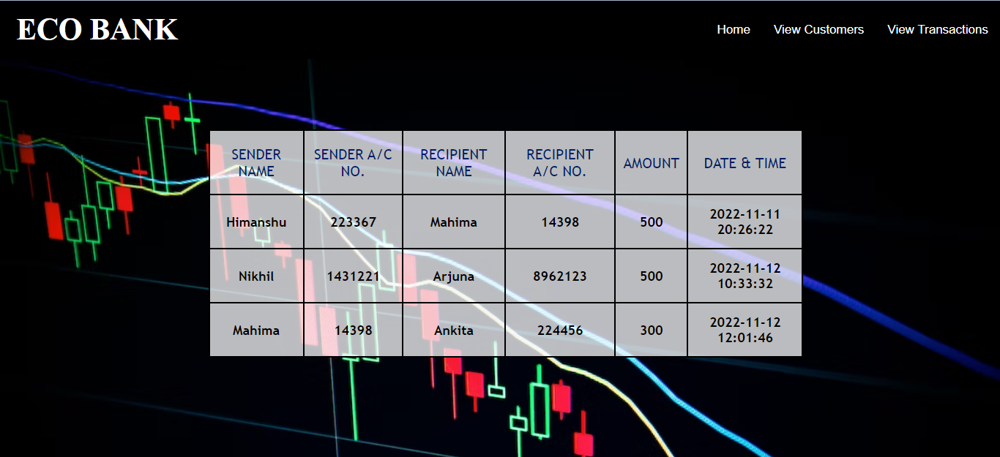

<h1>ECO BANK - <i> The Sparks Foundation, GRIP 2022 </i></h1>

   ECO Bank is a basic banking system, designed as a part of internship under <b> TASK 1 </b> of<b> Web Development and Designing </b>, it is a dynamic website which consist of multiple users, allowed to perform transactions between them.
 <b>Flow of website :</b> Home Page ➡ View Customer ➡ Select and View any customer ➡ Transfer Money ➡ Select customer to transfer money to ➡ View transactions
 

## 📓 Tools used

Front-End
<ul>
  <li>HTML</li>
  <li>CSS</li>
  <li>JS</li>
</ul>

Back-End
<ul>
  <li>Server : XAMPP</li>
  <li>PHP</li>
  <li>MYSQL</li>
</ul>

 

## 👀 Screenshots

## ✍ Author

- [Mahima Churi](https://github.com/Mahitej28)

 

## 📌 Features / Contributions
 - Any contributions you make are *greatly appreciated*
 - Would be glad to hear about *new features* to add in the website

 

## 🛡 License

You may use this project freely at your own risk. See [LICENSE](https://choosealicense.com/licenses/mit/).

    Copyright (c) 2022 Mahima Churi

<h3> Connect with me
</h3> 

     &nbsp&nbsp&nbsp
     &nbsp&nbsp&nbsp
    &nbsp&nbsp&nbsp
   

